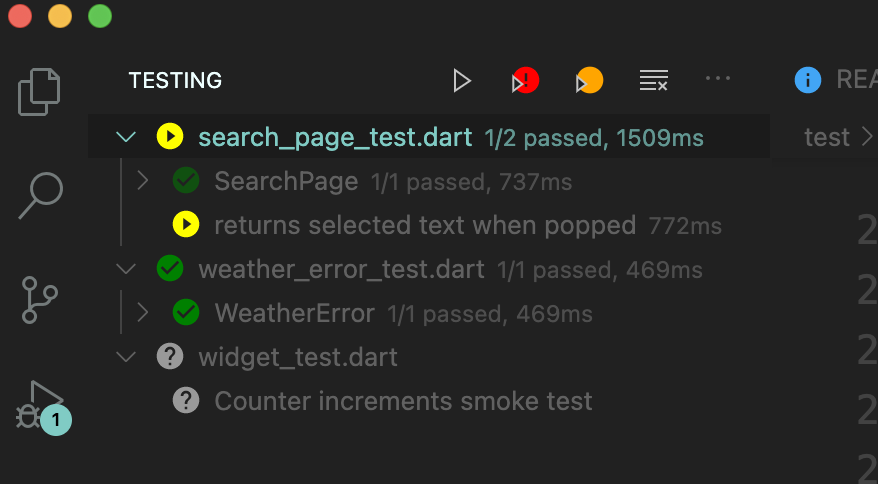

# flutter_weather_challenge by MarialijiDeveloper.
[](https://pub.dev/packages/very_good_analysis)

The objective of this flutter application about asynchronous programming in Dart II.
To demostrate 
## how to manage clear architecture.

- ✅  Clean Architecture
- ✅  Testing
- ✅  Performance
- ✅  Custom Animations

## To get started 
```
// To start run the following commands 

git clone [repo_url]

cd qr_generator_flutter

flutter pub get

flutter run --dart
```

## Flutter packages
 - [bloc: flutter_bloc package ] 
 - [dio]
 - [connectivity]
 - [json_serializable]
 - [spritewidget]
 - [provider]
 - [bloc_test]

## Testing
### ✅ Widget Test

  
  


- https://www.marialijideveloper.com

## API 
The api for the solution was provided by `metaweather API`.
We’ll be focusing on two endpoints:

  -  /api/location/search/?query=$city to get a locationId for a given city name
  -  /api/location/$locationId to get the weather for a given locationId


<hr style="border:2px solid blue"> </hr>


 